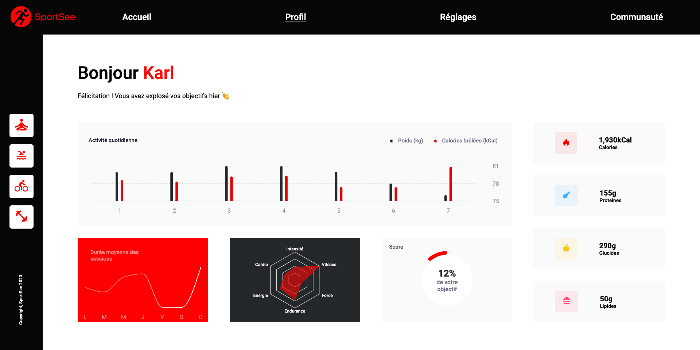

# 📂 SportSee
Ce dépôt contient le code source de la nouvelle page profil utilisateur pour l'application SportSee, une startup dédiée au coaching sportif. Cette page permet à l'utilisateur de suivre le nombre de sessions réalisées ainsi que le nombre de calories brûlées, grâce à des graphiques interactifs.

⚠️ **Attention** : Cette application n'est pas responsive pour le moment et fonctionne uniquement à partir d'une largeur d'écran de 1024px.

## 📸 Capture d'écran

Aperçu de la page profil utilisateur avec les graphiques d'activité.

## 🚀 Fonctionnalités
- **Graphique d'activité quotidienne** : Affiche le nombre de calories brûlées et les kilogrammes de protéines, glucides et lipides consommés par jour.
- **Graphique de sessions** : Représente le nombre de sessions réalisées par semaine, avec la durée de chaque session.
- **Graphique de performance** : Visualise les performances de l'utilisateur (endurance, intensité, etc.) sous forme de graphique radial.
- **Graphique de score** : Affiche le score global de l'utilisateur sur une jauge circulaire.
- **Informations clés** : Affiche les informations clés de l'utilisateur (nom, âge, poids, taille, etc.).

## 💻 Technologies Utilisées

## 📦 Installation
### Avec données mockées

1. Clonez ce dépôt : `git clone https://github.com/ssaili/SportSee.git`
2. Accédez au répertoire du projet : `cd SportSee`
3. Accédez au sous-dossier "sportsee-frontend" via la commande : `cd sportsee-frontend`
4. Installez les dépendances `npm install`
5. Démarrez l'application en mode développement : `npm start`
6. Ouvrez `http://localhost:3001` dans votre navigateur

⚠️ **Attention** : Seules les données mockées sont disponibles via cette installation.

### Avec données de l'API

1. Clonez ce dépôt : `git clone https://github.com/ssaili/SportSee.git`
2. Accédez au répertoire du projet : `cd SportSee`
3. Suivez les instructions du [guide d'installation de l'API](https://github.com/OpenClassrooms-Student-Center/P9-front-end-dashboard) pour configurer et démarrer le serveur backend.
4. Accédez au sous-dossier "sportsee-frontend" via la commande : `cd sportsee-frontend`
5. Installez les dépendances `npm install`
6. Démarrez l'application en mode développement : `npm start`
7. Ouvrez `http://localhost:3001` dans votre navigateur

⚠️ **Attention** : Assurez-vous que le serveur backend est en cours d'exécution pour que l'application puisse récupérer les données de l'API.
